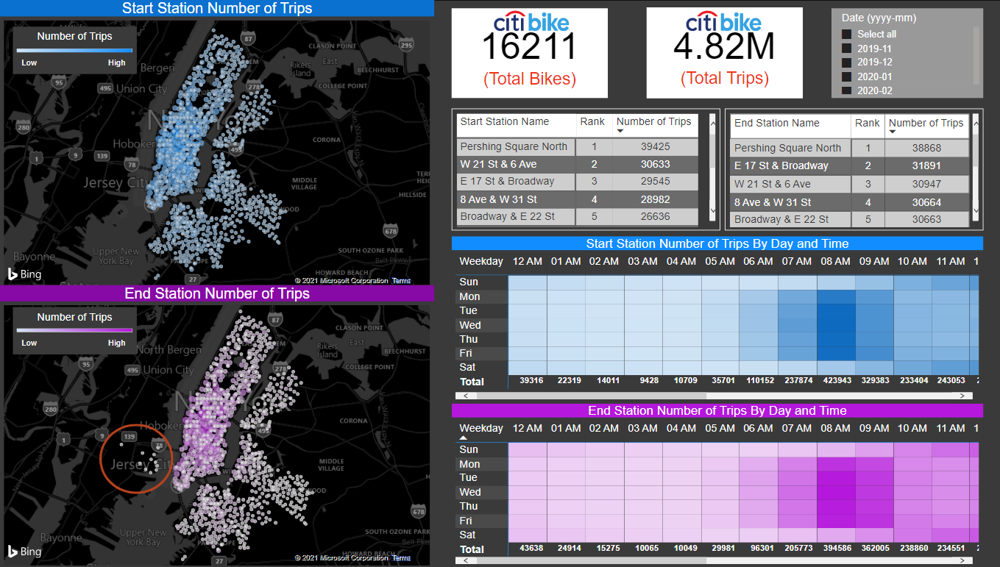
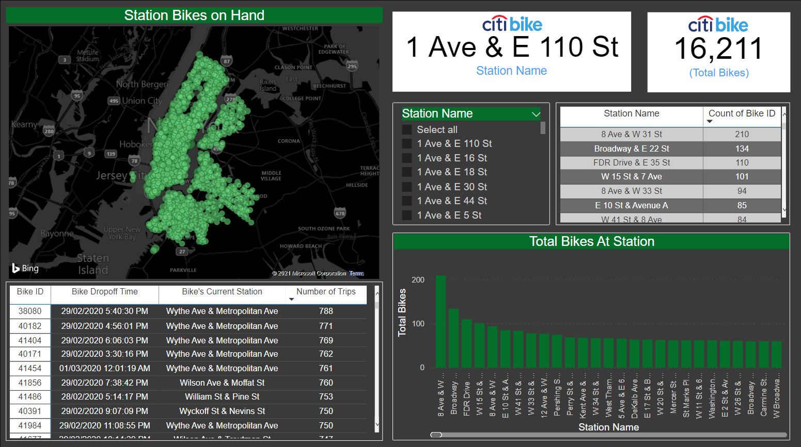

# Citi Bike Dashboard

Tools: Python, Power BI

Data Source: https://s3.amazonaws.com/tripdata/index.html

This dashboard was built using monthly data from Citi Bike. The data was imported and concatenated using Python and the final export was exported in construction of the dashboard. The dashboard was created using Power BI and will further analyze the various stations of Citi Bike and the bike inventory to assist with supply chain analysis. Data examined in the dashboard is dated from November 2019 to February 2020.

## Dashboard Report #1

The first dashboard examined the station and their popularity from count of trips. In the map, it demonstrates count of trips at both the start station and the end station. The ends stations circled identify that the customer do not start at those locations but do end their trip at those stations. This could be a inventory issue as if no one starts at this station but drop bikes at these stations to end their trip, those stations will continue to accumulate more and more bikes causing an uneven distribution of inventory. It would be advisable to redistribute those bikes every month to stations that need them more.

## Dashboard Report #2

The second dashboard gives you a live feeds on bike locations. On the map display the total bikes at each station presently or in this case the latest trip time of each bike (bike id). The company can use the map with the addition of the table of bike totals in each station to review if any bikes needs to be redistributed, for example if an unpopular station has many bikes we may want to redistribute those bikes to a more popular station. In addition, the table in the left bottom corner exhibits the bikes in the company's inventory and the number of trips the bike has been ridden. The company could set a benchmark that when a bike has reached a certain amount of trips that they should bring the bike in for maintenace or repairs. 

