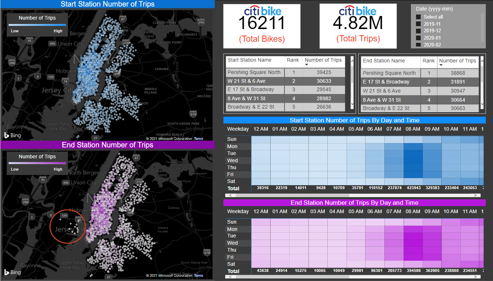

# Citi Bike Dashboard

Tools: Python, Power BI

Data Source: https://s3.amazonaws.com/tripdata/index.html

This dashboard was built using monthly data from Citi Bike. The data was imported and concatenated using Python and the final export was exported in construction of the dashboard. The dashboard was created using Power BI and will further analyze the various stations of Citi Bike and the bike inventory to assist with supply chain analysis. Data examined in the dashboard is dated from November 2019 to February 2020.

## Dashboard Report #1

## Dashboard Report #2

